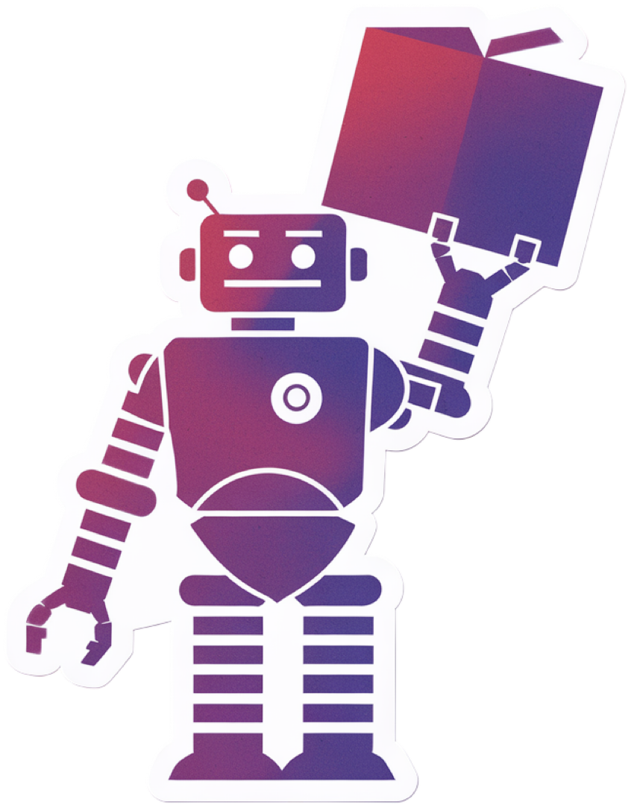
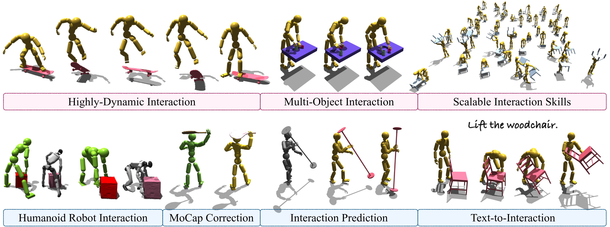

<p align="center">
<!-- <h1 align="center">InterDiff: Generating 3D Human-Object Interactions with Physics-Informed Diffusion</h1> -->
<h1 align="center"><sup></sup> <strong>InterMimic: Towards Universal Whole-Body Control for Physics-Based Human-Object Interactions</strong></h1>
  <p align="center">
    <a href='https://sirui-xu.github.io/' target='_blank'>Sirui Xu</a><sup></sup>&emsp;
    <a href='https://hungyuling.com/' target='_blank'>Hung Yu Ling</a> <sup></sup>&emsp;
    <a href='https://yxw.web.illinois.edu/' target='_blank'>Yu-Xiong Wang</a><sup></sup>&emsp;
    <a href='https://lgui.web.illinois.edu/' target='_blank'>Liang-Yan Gui</a><sup></sup>&emsp;
    <br>
    <sup></sup>University of Illinois Urbana-Champaign, <sup></sup> Electronic Arts
    <br>
    <strong>CVPR 2025 Highlight 🏆</strong>
  </p>
</p>

</p>
<p align="center">
  <a href='https://arxiv.org/abs/2502.20390'>
    </a>
  <a href='https://arxiv.org/pdf/2502.20390.pdf'>
    </a>
  <a href='https://sirui-xu.github.io/InterMimic/'>
    </a>
  <a href='https://youtu.be/ZJT387dvI9w'>
    </a>
  <a href='https://www.bilibili.com/video/BV1nW9KYFEUX/'>
    </a>
  <a href='https://github.com/Sirui-Xu/InterMimic'>
    </a>
</p>

## 🏠 Overview
<div align="center">
  
</div>

> **InterMimic** features **one** unified policy, spanning **diverse full-body interactions** with **dynamic, heterogeneous objects**—and it works out-of-the-box for both **SMPL-X** and **Unitree G1** humanoids.


## 📹 Demo
<p align="center">
    
</p>

## 🔥 News
- **[2025-06-10]** Release the instruction for the student policy inference.
- **[2025-06-03]** Initial release of PSI and the processed data. Next release: teacher policy inference for [dynamics-aware retargeting](InterAct/OMOMO_retarget), and student policy inference.
- **[2025-05-26]** It's been a while! The student policy training pipeline has been released! The PSI and other data construction pipelines will follow soon.
- **[2025-04-18]** Release a checkpoint with high‑fidelity physics and enhanced contact precision.
- **[2025-04-11]** The training code for teacher policies is live—try training your own policy!
- **[2025-04-05]** We're excited by the overwhelming interest in humanoid robot support and are ahead of schedule in open-sourcing our Unitree-G1 integration—starting with a small demo with support for G1 with its original three-finger dexterous hands. Join us in exploring whole-body loco-manipulation with humanoid robots!
- **[2025-04-04]** InterMimic has been selected as a CVPR Highlight Paper 🏆. More exciting developments are on the way!
- **[2025-03-25]** We’ve officially released the codebase and checkpoint for teacher policy inference demo — give it a try! ☕️  

## 📖 Getting Started

### Dependencies

Follow the following instructions: 

1. Create new conda environment and install pytorch:

    ```bash
    conda create -n intermimic python=3.8
    conda install pytorch torchvision torchaudio pytorch-cuda=11.6 -c pytorch -c nvidia
    pip install -r requirement.txt
    ```

    You may also build from [environment.yml](environment.yml), which might contain redundancies,
    ```bash
    conda env create -f environment.yml
    ```

2. Download and setup [Isaac Gym](https://developer.nvidia.com/isaac-gym). 

3. Download the [dataset](https://drive.google.com/file/d/141YoPOd2DlJ4jhU2cpZO5VU5GzV_lm5j/view?usp=sharing), unzip it, and move the extracted folder to `InterAct/OMOMO_new/`. *This build contains minor fixes to the original release, so your results may deviate slightly from those reported in the paper.*


4. Activate the environment:

    ```bash
    conda activate intermimic
    ```

### Data Replay


To replay the groud truth data, execute the following commands:

  ```bash
  sh scripts/data_replay.sh
  ```

*Note*: The output colors represent the ground truth contact markers for links.

### Teacher Policy Training


To train a teacher policy, execute the following commands:

  ```bash
  sh scripts/train_teacher.sh
  ```

A higher‑fidelity simulation enough for low-dynamic interaction (trading off some efficiency for realism):

  ```bash
  sh scripts/train_teacher_new.sh
  ```

**How to enable PSI**

Open the training config, for example, [`omomo_train_new.yaml`](./intermimic/data/cfg/omomo_train_new.yaml). Set

   ```yaml
   physicalBufferSize: <integer greater than 1>
   ```

**When to skip PSI**

OMOMO subjects `sub1`, `sub11`, `sub12`, and `sub13` include wrong flipped-hand frames that can push the motion out of bounds and stall the simulator. For those four subjects, leave `physicalBufferSize` at its default value (`1`) and train without PSI.

### Student Policy Training


To train a student policy with distillation, execute the following commands:

  ```bash
  sh scripts/train_student.sh
  ```

### Teacher Policy Inference


We’ve released a checkpoint for one (out of 17) teacher policy on OMOMO, along with some sample data. To get started:

1. Download the [checkpoints](https://drive.google.com/drive/folders/1biDUmde-h66vUW4npp8FVo2w0wOcK2_k?usp=sharing) and place them in the current directory.
2. Then, run the following commands:

    ```bash
    sh scripts/test_teacher.sh
    ```

3. Run the high‑fidelity modeling (trading off some efficiency for realism):

    ```bash
    sh scripts/test_teacher_new.sh
    ```

4. 🔥 To try it on the Unitree G1 with its three-fingered dexterous hand—directly learned from MoCap without any external retargeting:

    ```bash
    sh scripts/test_g1.sh
    ```

### Student Policy Inference


After finish the student policy training, run the inference with

  ```bash
  sh scripts/test_student.sh
  ```

## 📝 TODO List  
- [x] Release inference demo for the teacher policy  
- [x] Add support for Unitree-G1 with dexterous robot hands
- [x] Release training pipeline for the teacher policy 
- [x] Release student policy distillation training
- [x] Release processed MoCap
- [x] Release inference pipeline for the student policy 
- [ ] Distilled reference data (physically correct HOI data❗️), and all related checkpoints   
- [ ] Release all data and processing scripts alongside the [InterAct](https://github.com/wzyabcas/InterAct) launch  
- [ ] Release physics-based text-to-HOI and interaction prediction demo  


## 🔗 Citation

If you find our work helpful, please cite:

```bibtex
@inproceedings{xu2025intermimic,
  title = {{InterMimic}: Towards Universal Whole-Body Control for Physics-Based Human-Object Interactions},
  author = {Xu, Sirui and Ling, Hung Yu and Wang, Yu-Xiong and Gui, Liang-Yan},
  booktitle = {CVPR},
  year = {2025},
}
```

Our data is sourced from **InterAct**. Please consider citing:

```bibtex
@inproceedings{xu2025interact,
  title = {{InterAct}: Advancing Large-Scale Versatile 3D Human-Object Interaction Generation},
  author = {Xu, Sirui and Li, Dongting and Zhang, Yucheng and Xu, Xiyan and Long, Qi and Wang, Ziyin and Lu, Yunzhi and Dong, Shuchang and Jiang, Hezi and Gupta, Akshat and Wang, Yu-Xiong and Gui, Liang-Yan},
  booktitle = {CVPR},
  year = {2025},
}
```
Please also consider citing the specific sub-dataset you used from **InterAct**.

Our integrated kinematic model builds upon **InterDiff**, **HOI-Diff**, and **InterDreamer**. Please consider citing the following if you find this component useful:

```bibtex
@inproceedings{xu2024interdreamer,
  title = {{InterDreamer}: Zero-Shot Text to 3D Dynamic Human-Object Interaction},
  author = {Xu, Sirui and Wang, Ziyin and Wang, Yu-Xiong and Gui, Liang-Yan},
  booktitle = {NeurIPS},
  year = {2024},
}

@inproceedings{xu2023interdiff,
  title = {{InterDiff}: Generating 3D Human-Object Interactions with Physics-Informed Diffusion},
  author = {Xu, Sirui and Li, Zhengyuan and Wang, Yu-Xiong and Gui, Liang-Yan},
  booktitle = {ICCV},
  year = {2023},
}

@article{peng2023hoi,
  title = {HOI-Diff: Text-Driven Synthesis of 3D Human-Object Interactions using Diffusion Models},
  author = {Peng, Xiaogang and Xie, Yiming and Wu, Zizhao and Jampani, Varun and Sun, Deqing and Jiang, Huaizu},
  journal = {arXiv preprint arXiv:2312.06553},
  year = {2023}
}
```

Our SMPL-X-based humanoid model is adapted from PHC. Please consider citing:

```bibtex
@inproceedings{Luo2023PerpetualHC,
  author = {Zhengyi Luo and Jinkun Cao and Alexander W. Winkler and Kris Kitani and Weipeng Xu},
  title = {Perpetual Humanoid Control for Real-time Simulated Avatars},
  booktitle = {ICCV},
  year = {2023}
}
```

## 👏 Acknowledgements and 📚 License

This repository builds upon the following excellent open-source projects:

- [IsaacGymEnvs](https://github.com/isaac-sim/IsaacGymEnvs): Contributes to the environment code
- [rl_games](https://github.com/Denys88/rl_games): Serves as the core reinforcement learning framework
- [PHC](https://github.com/ZhengyiLuo/PHC): Used for data construction  
- [PhysHOI](https://github.com/wyhuai/PhysHOI): Contributes to the environment code  
- [InterAct](https://github.com/wzyabcas/InterAct), [OMOMO](https://github.com/lijiaman/omomo_release): Core resource for dataset construction  
- [InterDiff](https://github.com/Sirui-Xu/InterDiff): Supports kinematic generation  
- [HOI-Diff](https://github.com/neu-vi/HOI-Diff): Supports kinematic generation  

This codebase is released under the [MIT License](LICENSE).  
Please note that it also relies on external libraries and datasets, each of which may be subject to their own licenses and terms of use.


## 🌟 Star History

<p align="center">
    <a href="https://star-history.com/#Sirui-Xu/InterMimic&Date" target="_blank">
        
    </a>
<p>
